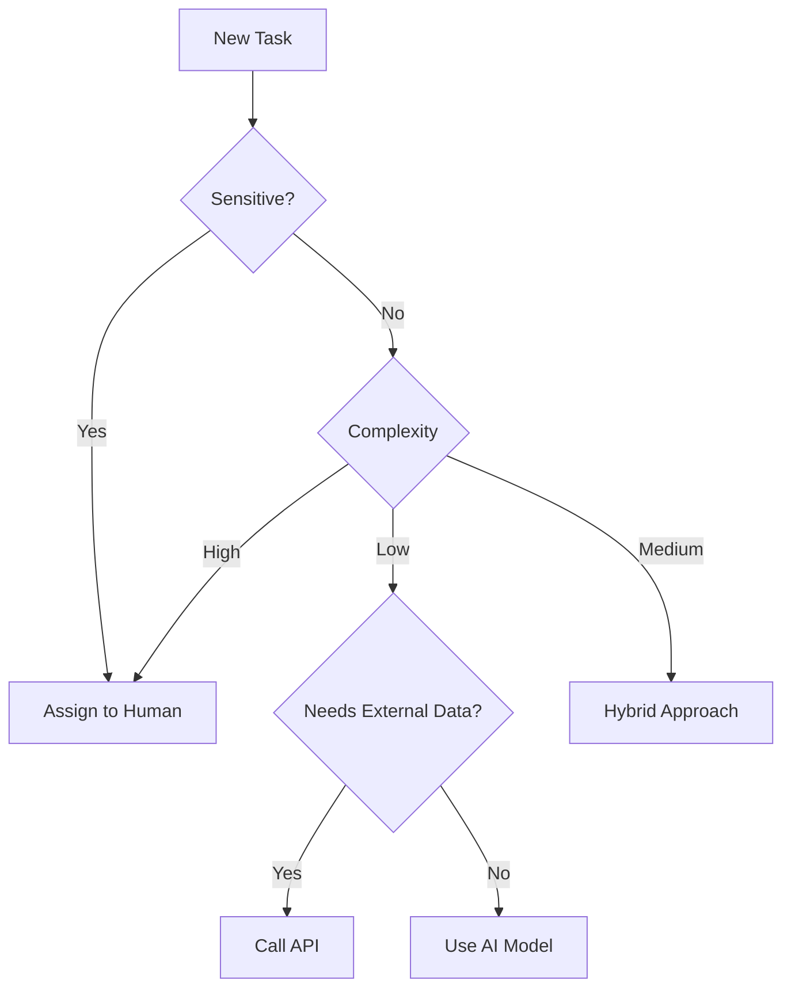

# AI Task Delegation Agent (AITDA)

This document outlines a conceptual architecture for an AI agent that delegates tasks between different AI models, external APIs, and human reviewers.

## System Overview

1. **Input Layer** – Accepts user requests in text, voice, or structured formats. Performs basic preprocessing such as normalization and entity extraction.
2. **Context Analyzer** – Detects intent, classifies complexity, assesses urgency, and determines sensitivity.
3. **Task Planner and Orchestrator** – Central logic that decides whether to route tasks to AI models, external APIs, or humans. Provides fallback strategies when confidence is low.
4. **Delegation Targets**
   - **AI Models** – LLMs for text, vision models for images, or speech models for audio tasks.
   - **External APIs** – Data sources, transactional services, or search APIs.
   - **Human Input** – For judgment‑heavy or sensitive requests.

A simplified decision flow is illustrated below using Mermaid syntax.

## Prototype Logic

The accompanying file `src/taskDelegationAgent.js` includes a minimal prototype demonstrating how such a delegator might be structured in JavaScript.
